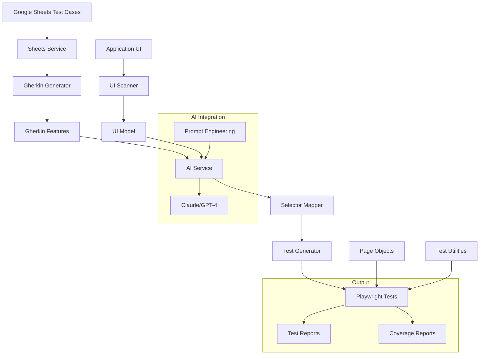
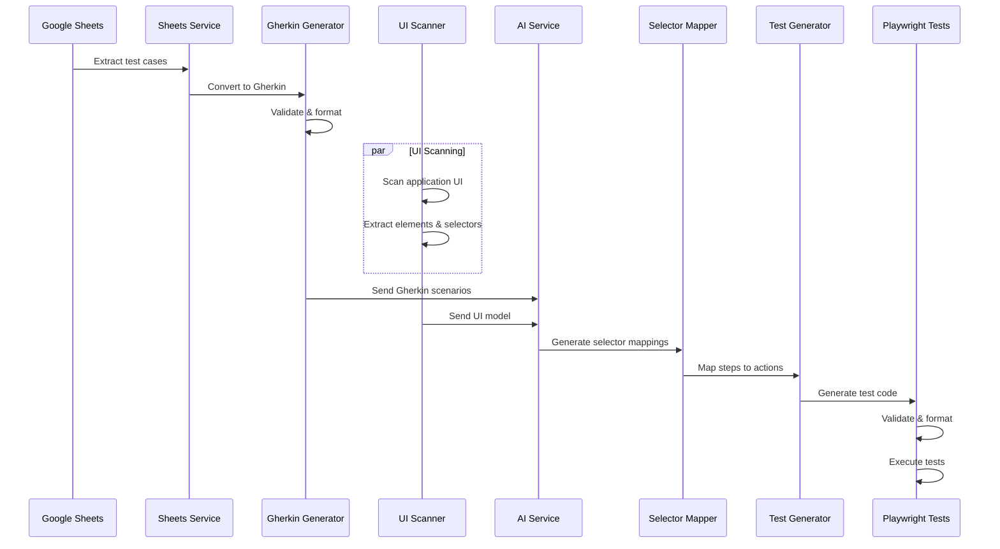
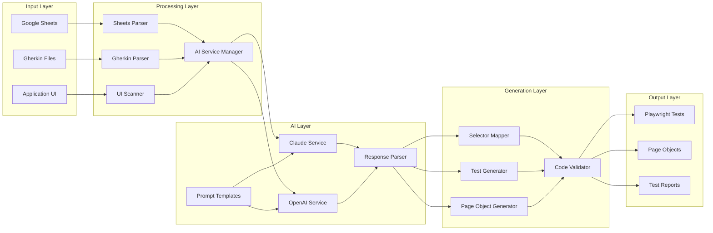
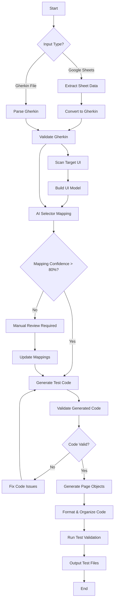
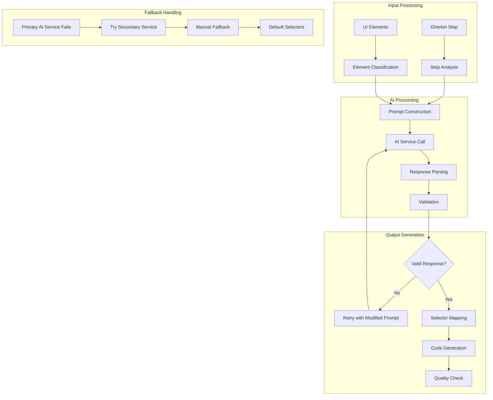
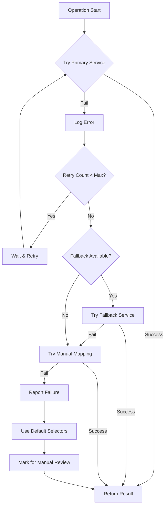
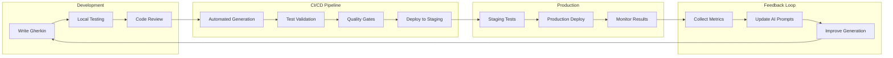
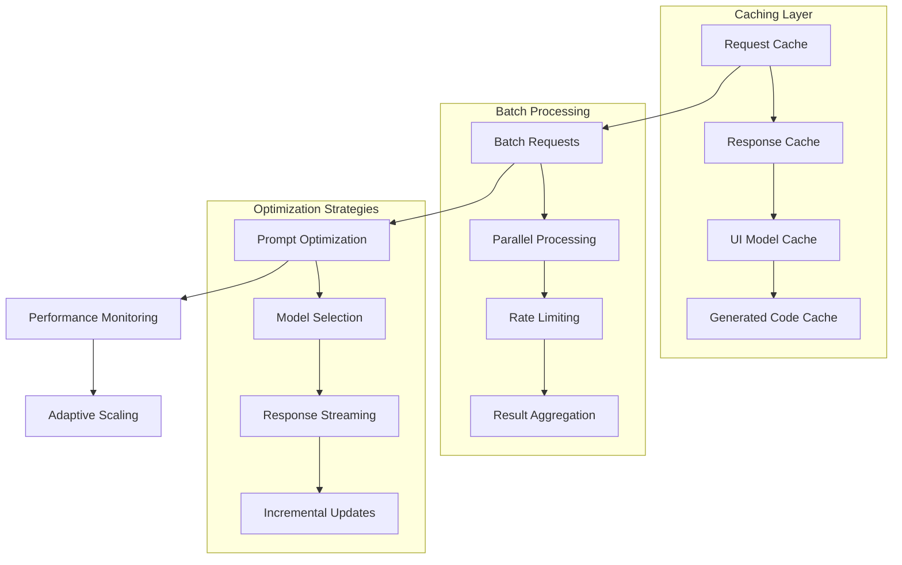

# Gherkin E2E Automation Workflow Diagrams

Visual representations of the AI-powered test generation workflow.

## Overall Architecture

## Data Flow Pipeline

## Component Interaction

## Test Generation Process

## AI Integration Flow

## Error Handling Strategy

## Deployment Pipeline

## Performance Optimization

These diagrams provide a comprehensive visual understanding of the Gherkin E2E Automation workflow, from input processing through AI integration to final test generation and deployment.